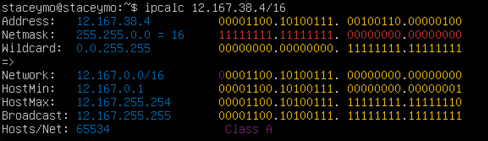
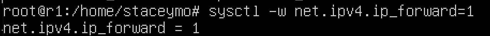
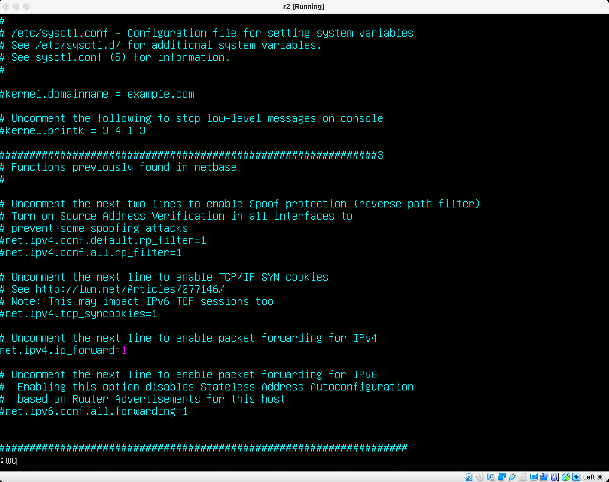
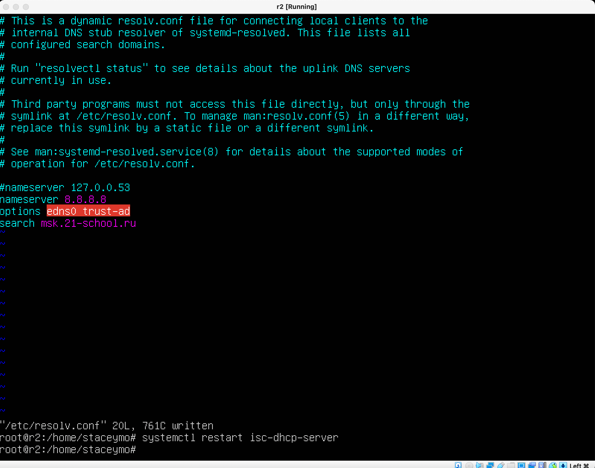
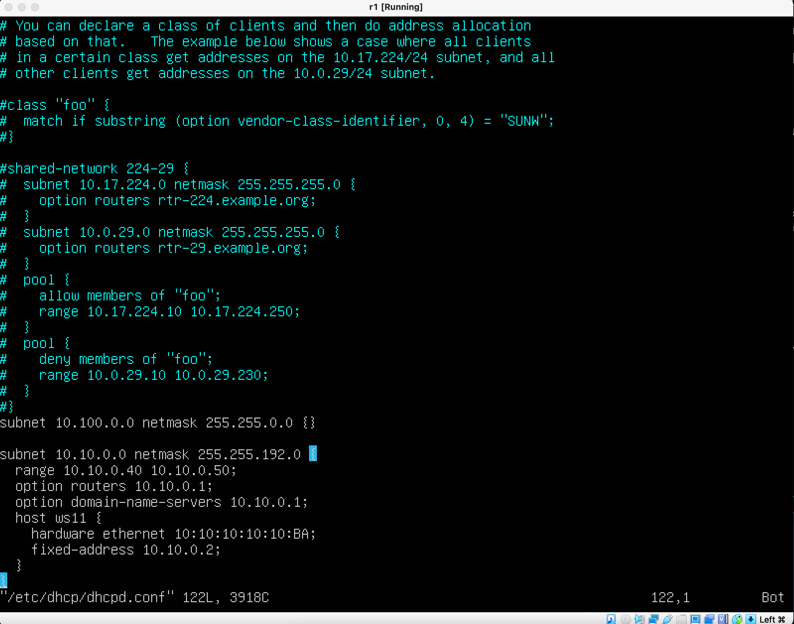

# Сети в Linux

1. [Chapter I](#chapter-i)
2. [Chapter II](#chapter-ii) \
   2.1. [Стек протоколов TCP IP](#стек-протоколов-tcp-ip) \
   2.2. [Адресация](#адресация) \
   2.3. [Маршрутизация](#маршрутизация)
3. [Chapter III](#chapter-iii) \
   3.1. [Инструмент ipcalc](#part-1-инструмент-ipcalc) \
   3.2. [Статическая маршрутизация между двумя машинами](#part-2-статическая-маршрутизация-между-двумя-машинами) \
   3.3. [Утилита iperf3](#part-3-утилита-iperf3) \
   3.4. [Сетевой экран](#part-4-сетевой-экран) \
   3.5. [Статическая маршрутизация сети](#part-5-статическая-маршрутизация-сети) \
   3.6. [Динамическая настройка IP с помощью DHCP](#part-6-динамическая-настройка-ip-с-помощью-dhcp) \
   3.7. [NAT](#part-7-nat) \
   3.8. [Допополнительно. Знакомство с SSH Tunnels](#part-8-дополнительно-знакомство-с-ssh-tunnels)
4. [Chapter IV](#chapter-iv)

## Part 1. Инструмент **ipcalc**

##### Поднять виртуальную машину (далее -- ws1)

_создали виртуальную машину ws1_

#### 1.1. Сети и маски
##### Определить и записать в отчёт:
##### 1) Адрес сети *192.167.38.54/13*

_ipcalc 192.167.38.54/13_

##### 2) Перевод маски *255.255.255.0* в префиксную и двоичную запись, */15* в обычную и двоичную, *11111111.11111111.11111111.11110000* в обычную и префиксную

1. /24 11111111.11111111.11111111.00000000

_префиксное и двоичное отображение маски_

2. 255.254.0.0 11111111.11111110.00000000.00000000

/15 conversion

3. 255.255.255.240/28

/28 conversion

##### 3) Минимальный и максимальный хост в сети *12.167.38.4* при масках: */8*, *11111111.11111111.00000000.00000000*, *255.255.254.0* и */4*

1. 12.167.38.4
Минимальный хост 12.0.0.1
Максимальный хост 12.255.255.254

Minimum and maximum host in 12.167.38.4 network with mask: /8

2. 11111111.11111111.00000000.00000000
Минимальный хост 12.167.0.1
Максимальный хост 12.167.255.254

Minimum and maximum host in 12.167.38.4 network with mask: /11111111.11111111.00000000.00000000

3. 255.255.254.0
Минимальный хост 12.167.38.1
Максимальный хост 12.167.39.254

Minimum and maximum host in 12.167.38.4 network with mask: /11111111.11111111.00000000.00000000

4. /4
Минимальный хост 0.0.0.1
Максимальный хост 15.255.255.254

#### 1.2. localhost
##### Определить и записать в отчёт, можно ли обратиться к приложению, работающему на localhost, со следующими IP: *194.34.23.100*, *127.0.0.2*, *127.1.0.1*, *128.0.0.1*

1. 194.34.23.100 - нет
2. 127.0.0.2 - да
3. 127.1.0.1 - да
4. 128.0.0.1 - нет

#### 1.3. Диапазоны и сегменты сетей
##### Определить и записать в отчёт:
##### 1) какие из перечисленных IP можно использовать в качестве публичного, а какие только в качестве частных: *10.0.0.45*, *134.43.0.2*, *192.168.4.2*, *172.20.250.4*, *172.0.2.1*, *192.172.0.1*, *172.68.0.2*, *172.16.255.255*, *10.10.10.10*, *192.169.168.1*

- частные: 10.0.0.45, 192.168.4.2, 172.20.250.4, 172.16.255.255, 10.10.10.10
- публичные: 134.43.0.2, 172.0.2.1, 192.172.0.1, 172.68.0.2, 192.169.168.1

##### 2) какие из перечисленных IP адресов шлюза возможны у сети *10.10.0.0/18*: *10.0.0.1*, *10.10.0.2*, *10.10.10.10*, *10.10.100.1*, *10.10.1.255*

- возможны: 10.10.0.2, 10.10.10.10, 10.10.1.255
- невозможны: 10.0.0.1, 10.10.100.1 - интерфейсы администрирования

## Part 2. Статическая маршрутизация между двумя машинами

##### Поднять две виртуальные машины (далее -- ws1 и ws2)

##### С помощью команды `ip a` посмотреть существующие сетевые интерфейсы

_Вывод команды ip a_ ws1

_Вывод команды ip a_ ws2

##### Описать сетевой интерфейс, соответствующий внутренней сети, на обеих машинах и задать следующие адреса и маски: ws1 - *192.168.100.10*, маска */16*, ws2 - *172.24.116.8*, маска */12*

_Настройки внутренней сети для ws-1_

_Настройки внутренней сети для ws-2_

##### Выполнить команду `netplan apply` для перезапуска сервиса сети

_Вызов и вывод команды sudo netplan apply ws-1_

_Вызов и вывод команды sudo netplan apply ws-2_

#### 2.1. Добавление статического маршрута вручную

_ping 1_

_ping 2_

#### 2.2. Добавление статического маршрута с сохранением

##### Добавить статический маршрут от одной машины до другой с помощью файла *etc/netplan/00-installer-config.yaml*

_Настройки ws1_

_Настройки ws2_

##### Пропинговать соединение между машинами

_ ping ws1_

_ping ws2_

## Part 3. Утилита **iperf3**

#### 3.1. Скорость соединения
##### Перевести и записать в отчёт: 8 Mbps в MB/s, 8 Mbps в MB/s, 1 Gbps в Mbps
8 Mbps в MB/s = 1 MB/s
100 MB/s Mbps в Kbps = 819000 Kbps
1 Gbps в Mbps = 1024 Mbps

#### 3.2. Утилита **iperf3**
##### Измерить скорость соединения между ws1 и ws2

1. Скачиваем утилиту iperf3
2. Запускаем утилиту iperf3
3. На машине ws1 вводим iperf3 -c и далее ip ws2

Результат на скриншотах.

_Вводим ip ws2 на машину ws1_

_Результат iperf3 на машине ws2_

## Part 4. Сетевой экран

`-` После соединения машин, перед нами стоит следующая задача: контролировать информацию, проходящую по соединению. Для этого используются сетевые экраны.

**== Задание ==**

*В данном задании используются виртуальные машины ws1 и ws2 из Части 2*

#### 4.1. Утилита **iptables**
##### Создать файл *, имитирующий фаерволл, на ws1 и ws2:

iptables команда критерий цель
-A - добавить правило в конец указанной цепочки

Критерии:
-p - тип протокола

_iptables настройка на машине ws1_

_iptables настройка на машине ws2_

_Запускаем скрипт на машине ws1_

_Запускаем скрипт на машине ws2_

##### Нужно добавить в файл подряд следующие правила:
##### 1) на ws1 применить стратегию когда в начале пишется запрещающее правило, а в конце пишется разрешающее правило (это касается пунктов 4 и 5)
##### 2) на ws2 применить стратегию когда в начале пишется разрешающее правило, а в конце пишется запрещающее правило (это касается пунктов 4 и 5)
##### 3) открыть на машинах доступ для порта 22 (ssh) и порта 80 (http)
##### 4) запретить *echo reply* (машина не должна "пинговаться”, т.е. должна быть блокировка на OUTPUT)
##### 5) разрешить *echo reply* (машина должна "пинговаться")

##### Запустить файлы на обеих машинах командами `chmod +x /etc/firewall.sh` и `/etc/firewall.sh`
- В отчёт поместить скрины с запуском обоих файлов.
- В отчёте описать разницу между стратегиями, применёнными в первом и втором файлах.

#### 4.2. Утилита **nmap**
##### Командой **ping** найти машину, которая не "пингуется", после чего утилитой **nmap** показать, что хост машины запущен

_nmap ws1_

##### Сохранить дампы образов виртуальных машин
**p.s. Ни в коем случае не сохранять дампы в гит!**

## Part 5. Статическая маршрутизация сети

##### Поднять пять виртуальных машин (3 рабочие станции (ws11, ws21, ws22) и 2 роутера (r1, r2))

#### 5.1. Настройка адресов машин
##### Настроить конфигурации машин в *etc/netplan/00-installer-config.yaml* согласно сети на рисунке.

_Настройки netplan ws11_

_Настройки netplan ws22_

_Настройки netplan ws21_

_Настройки netplan r1_

_Настройки netplan r2_

##### Перезапустить сервис сети. Если ошибок нет, то командой `ip -4 a` проверить, что адрес машины задан верно. Также пропинговать ws22 с ws21. Аналогично пропинговать r1 с ws11.

_ping ws21 + ip -4 a_

_ping ws22 + ip -4 a_

_ping ws11_

_ip -4 a for r1_

_ip -4 a for r2_

#### 5.2. Включение переадресации IP-адресов.
##### Для включения переадресации IP, выполните команду на роутерах:
`sysctl -w net.ipv4.ip_forward=1`

_применение команды на r1_

_применение команды на r2_

##### Откройте файл */etc/sysctl.conf* и добавьте в него следующую строку:

_Изменение файла на r1_

_Изменение файла на r2_

#### 5.3. Установка маршрута по-умолчанию

##### Настроить маршрут по-умолчанию (шлюз) для рабочих станций. Для этого добавить gateway4 \[ip роутера\] в файле конфигураций

Смотреть пункт 5.1

##### Вызвать `ip r` и показать, что добавился маршрут в таблицу маршрутизации

_Вывод команды ip r ws11_

_Вывод команды ip r ws21_

_Вывод команды ip r ws22_

##### Пропинговать с ws11 роутер r2 и показать на r2, что пинг доходит. Для этого использовать команду:
`tcpdump -tn -i eth1`

 

_Пинг между r2 и ws11, один пакет принят_

#### 5.4. Добавление статических маршрутов
##### Добавить в роутеры r1 и r2 статические маршруты в файле конфигураций. Пример для r1 маршрута в сетку 10.20.0.0/26:

_network plan r2_

_network plan r1_

##### Вызвать `ip r` и показать таблицы с маршрутами на обоих роутерах. Пример таблицы на r1:

_ip r r1_

_ip r r2_

##### Запустить команды на ws11:
`ip r list 10.10.0.0/[маска сети]` и `ip r list 0.0.0.0/0`

_ip r list 10.10.0.0/18 && ip r list 0.0.0.0/0_

Статический маршрут по умолчанию — это маршрут, которому соответствуют все пакеты. Вместо хранения всех маршрутов ко всем сетям в таблице маршрутизации маршрутизатор может хранить один маршрут по умолчанию, представляющий любую сеть, отсутствующую в таблице маршрутизации.

Маршрутизаторы обычно используют маршруты по умолчанию, настроенные локально или полученные от другого маршрутизатора, с помощью протокола динамической маршрутизации. Маршрут по умолчанию используется, если ни один из маршрутов в таблице маршрутизации не совпадает с IP-адресом места назначения пакета. Иными словами, при отсутствии более точных совпадений в качестве «шлюза последней надежды» используется маршрут по умолчанию.

Статические маршруты по умолчанию обычно используются при подключении:

пограничного маршрутизатора к сети интернет-провайдера или
тупикового маршрутизатора (маршрутизатора только с одним соседним маршрутизатором в восходящем направлении).

#### 5.5. Построение списка маршрутизаторов

##### Запустить на r1 команду дампа:
`tcpdump -tnv -i eth0`
##### При помощи утилиты **traceroute** построить список маршрутизаторов на пути от ws11 до ws21

_tcpdump for r1_

_traceroute_

Вы, наверное, уже знаете, что вся информация в сети передается в виде пакетов. Поток данных разбивается специальным программным обеспечением на небольшие пакеты и передается через сеть интернет на целевой узел, а там собирается обратно.

Каждый пакет проходит на своем пути определенное количество узлов, пока достигнет своей цели. Причем, каждый пакет имеет свое время жизни. Это количество узлов, которые может пройти пакет перед тем, как он будет уничтожен. Этот параметр записывается в заголовке TTL, каждый маршрутизатор, через который будет проходить пакет уменьшает его на единицу. При TTL=0 пакет уничтожается, а отправителю отсылается сообщение Time Exceeded.

Команда traceroute linux использует UDP пакеты. Она отправляет пакет с TTL=1 и смотрит адрес ответившего узла, дальше TTL=2, TTL=3 и так пока не достигнет цели. Каждый раз отправляется по три пакета и для каждого из них измеряется время прохождения. Пакет отправляется на случайный порт, который, скорее всего, не занят. Когда утилита traceroute получает сообщение от целевого узла о том, что порт недоступен трассировка считается завершенной.

#### 5.6. Использование протокола **ICMP** при маршрутизации
##### Запустить на r1 перехват сетевого трафика, проходящего через eth0 с помощью команды:
`tcpdump -n -i eth0 icmp`
##### Пропинговать с ws11 несуществующий IP (например, *10.30.0.111*) с помощью команды:
`ping -c 1 10.30.0.111`

_r1 tcpdump_

_ping 10.30.0.111_

##### Сохранить дампы образов виртуальных машин
**p.s. Ни в коем случае не сохранять дампы в гит!**

## Part 6. Динамическая настройка IP с помощью **DHCP**

**== Задание ==**

##### Для r2 настроить в файле */etc/dhcp/dhcpd.conf* конфигурацию службы **DHCP**:
##### 1) указать адрес маршрутизатора по-умолчанию, DNS-сервер и адрес внутренней сети. Пример файла для r2:

1. Необходимо скачать isc-dhcp-server

_настройки роутера r2_

##### 2) в файле *resolv.conf* прописать `nameserver 8.8.8.8.`

_настройки роутера r2_

##### Перезагрузить службу **DHCP** командой `systemctl restart isc-dhcp-server`. Машину ws21 перезагрузить при помощи `reboot` и через `ip a` показать, что она получила адрес. Также пропинговать ws22 с ws21.

ip a до 

_ip a после

_ping ws22 && ws21_

##### Указать MAC адрес у ws11, для этого в *etc/netplan/00-installer-config.yaml* надо добавить строки: `macaddress: 10:10:10:10:10:BA`, `dhcp4: true`

_macaddress ws11_

##### Для r1 настроить аналогично r2, но сделать выдачу адресов с жесткой привязкой к MAC-адресу (ws11). Провести аналогичные тесты

_настройки роутера r1_

_настройки роутера r1_

##### Запросить с ws21 обновление ip адреса

_ws21 до_

_ws21 после_

_ping_

Для того, чтобы запросить обновление у машины ws21 ip адреса, необходимо использовать команды:
-sudo dhclient -r - очищаем текущий ip
-sudo dhclient - назначаем свободный

##### Сохранить дампы образов виртуальных машин
**p.s. Ни в коем случае не сохранять дампы в гит!**

## Part 7. **NAT**

NAT (Network Address Translation, преобразование сетевых адресов) - это механизм работающий в IP-сетях и позволяющий преобразовывать IP-адреса транзитных пакетов. Протокол IP - маршрутизируемый протокол сетевого уровня (L3), предназначенный для передачи данных между сетями. Единицей передачи данных на уровне IP-протокола является пакет.
В таблице nat доступно два основных действия:

SNAT - Source Network Address Translation - изменение адреса и порта источника пакета, доступен в цепочке POSTROUTING
DNAT - Destination Network Address Translation - изменение адреса и порта назначения пакета, доступен в цепочках PREROUTING и OUTPUT

**== Задание ==**

##### В файле */etc/apache2/ports.conf* на ws22 и r1 изменить строку `Listen 80` на `Listen 0.0.0.0:80`, то есть сделать сервер Apache2 общедоступным

_ws22 configuration ports.conf_

_r1 configuration ports.conf_

##### Запустить веб-сервер Apache командой `service apache2 start` на ws22 и r1

_Запуск apache2_

##### Добавить в фаервол, созданный по аналогии с фаерволом из Части 4, на r2 следующие правила:
##### 1) Удаление правил в таблице filter - `iptables -F`
##### 2) Удаление правил в таблице "NAT" - `iptables -F -t nat`
##### 3) Отбрасывать все маршрутизируемые пакеты - `iptables --policy FORWARD DROP`
##### Запускать файл также, как в Части 4
##### Проверить соединение между ws22 и r1 командой `ping`

_iptables_

_неудачный пинг_

##### Добавить в файл ещё одно правило:
##### 4) Разрешить маршрутизацию всех пакетов протокола **ICMP**
##### Запускать файл также, как в Части 4
##### Проверить соединение между ws22 и r1 командой `ping`

_настройки iptables_

_удачный пинг_

##### Добавить в файл ещё два правила:
##### 5) Включить **SNAT**, а именно маскирование всех локальных ip из локальной сети, находящейся за r2 (по обозначениям из Части 5 - сеть 10.20.0.0)

Что такое Snat?
SNAT (Source Network Address Translation) — механизм, суть которого состоит в замене адреса источника при пересылке пакета. Сначала нужно узнать доступный нам внешний IP-адрес или диапазон IP-адресов.
Ключ -t указывает используемую таблицу, если данный ключ не указан, то по умолчанию используется таблица filter. Запись добавляется в цепочку POSTROUTING.
Для SNAT обязательно указывается параметр --to-source, который используется для указания адреса, присваиваемому пакету, теперь именно этот адрес будет указываться в качестве исходящего.
-i - интерфейс, с которого получен пакет 

##### 6) Включить **DNAT** на 8080 порт машины r2 и добавить к веб-серверу Apache, запущенному на ws22, доступ извне сети

##### Запускать файл также, как в Части 4
##### Проверить соединение по TCP для **SNAT**, для этого с ws22 подключиться к серверу Apache на r1 командой:
`telnet [адрес] [порт]`
##### Проверить соединение по TCP для **DNAT**, для этого с r1 подключиться к серверу Apache на ws22 командой `telnet` (обращаться по адресу r2 и порту 8080)

_настройки r2_

_удачный пинг_

##### Сохранить дампы образов виртуальных машин
**p.s. Ни в коем случае не сохранять дампы в гит!**

## Part 8. Дополнительно. Знакомство с **SSH Tunnels**

**== Задание ==**
##### Запустить веб-сервер **Apache** на ws22 только на localhost (то есть не изменять файл */etc/apache2/ports.conf* или, если был изменен ранее, вернуть строку `Listen 80`)

_изменение настроек_

##### Воспользоваться *Local TCP forwarding* с ws21 до ws22, чтобы получить доступ к веб-серверу на ws22 с ws21
в ws22 прописать ssh -R 8080:1010.0.2:80 staceymo@localhost

_изменение настроек_

_проверка соединения_

##### Воспользоваться *Remote TCP forwarding* c ws11 до ws22, чтобы получить доступ к веб-серверу на ws22 с ws11

_изменение настроек_

_изменение настроек_

_проверка соединения_
##### Для проверки, сработало ли подключение в обоих предыдущих пунктах, перейдите во второй терминал (например, клавишами Alt + F2) и выполните команду:
`telnet 127.0.0.1 [локальный порт]`
##### Сохранить дампы образов виртуальных машин
**p.s. Ни в коем случае не сохранять дампы в гит!**
